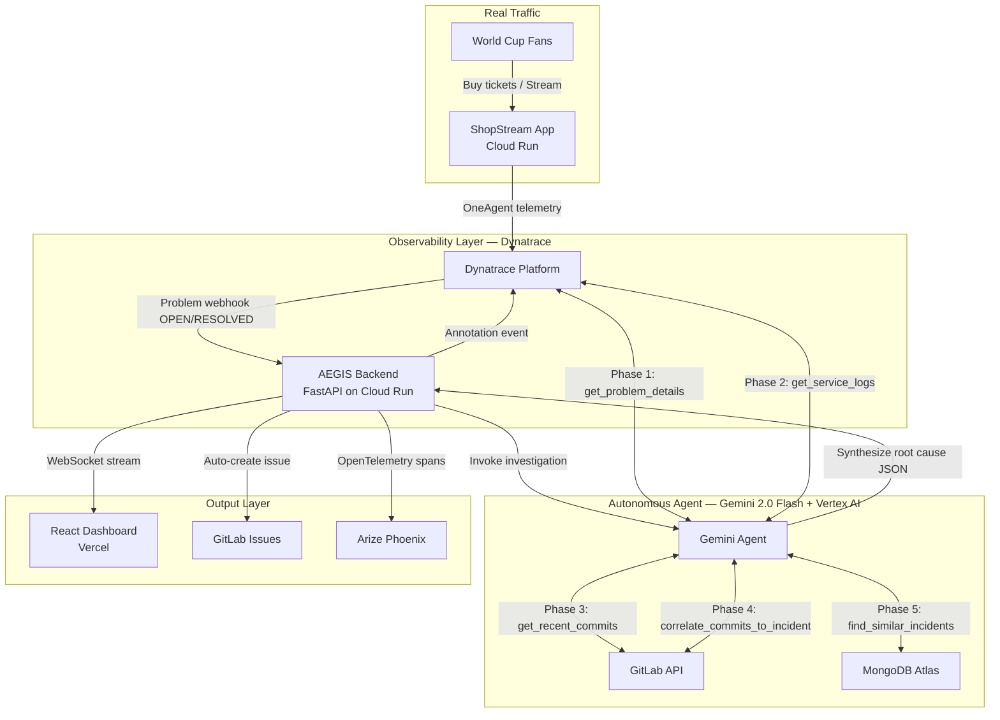

# AEGIS 🛡️
### Autonomous Incident Response Agent — 0 to Resolved in Under 90 Seconds

[](https://aegis.vercel.app)
[](https://youtube.com/watch?v=placeholder)
[](https://fastapi.tiangolo.com)
[](https://reactjs.org)
[](https://deepmind.google/technologies/gemini)
[](https://dynatrace.com)
[](https://gitlab.com)
[](https://mongodb.com/atlas)
[](https://phoenix.arize.com)

> **Built for the Google Cloud Rapid Agent Hackathon 2026 — Dynatrace Track**

---

## 🎯 The Problem

**5 billion people** will watch the 2026 FIFA World Cup.  
The platforms serving them — ticketing, streaming, fantasy leagues — run on cloud infrastructure that **cannot go down during a penalty shootout.**

When something breaks today, here is what happens:
- Pager fires at 3am
- Engineer logs in, opens 6 dashboards
- 45 minutes of manual log digging, commit archaeology, Slack threads
- Service restored. Users already gone. Revenue lost.

**Average enterprise P1 MTTR: 4.2 hours.**  
**Average cost: $5,600 per minute of downtime.**

---

## ⚡ The Solution

AEGIS is an **autonomous incident response agent** that replaces that 45-minute human process with a 90-second AI-driven investigation and remediation loop.

```
Dynatrace detects anomaly
        ↓ (webhook, <10 seconds)
Gemini 2.0 Flash agent activates
        ↓ (5-phase investigation)
Root cause identified + culprit commit found
        ↓ (GitLab issue auto-created)
Fix recommended + executed with human approval
        ↓ (total time: under 90 seconds)
Incident resolved. World Cup continues.
```

**This is not a chatbot. This is an agent that does the job.**

---

## 🏗️ Architecture



---

## 🤝 Partner Integrations — Why Each One Matters

### 🔵 Dynatrace (Primary Track)
Dynatrace is the **detection and telemetry backbone** of AEGIS. Without Dynatrace, the agent is blind.

- **Problems API** — Agent pulls real-time P1/P2/P3 problem data including affected entities, severity, and start timestamp
- **Logs API** — Agent fetches actual error logs and stack traces from the failing service
- **Metrics API** — Agent pulls error rate and latency time series to quantify blast radius
- **Events API** — Agent posts a resolution annotation back to Dynatrace when fix is executed
- **Webhook Integration** — Dynatrace fires the trigger that starts the entire investigation chain

AEGIS is the **action layer that multiplies Dynatrace's existing investment.** Davis AI tells you what broke. AEGIS fixes it.

### 🟠 GitLab
GitLab is the **deployment correlation engine** — the answer to "what changed?"

- Queries commits in the 15-minute window before incident start time
- Identifies the **specific commit** touching the affected service
- Auto-creates a **GitLab Issue** with full incident context attached
- Generates rollback command referencing the culprit commit SHA

### 🟢 MongoDB Atlas
MongoDB is the **institutional memory** — the answer to "has this happened before?"

- Stores every investigated incident with root cause and resolution
- Semantic search finds similar past incidents by service name and error type
- Agent uses past resolutions to improve current recommendations
- Powers the historical analytics dashboard

### 🟣 Arize Phoenix
Arize is the **agent quality monitor** — ensuring the AI makes good decisions.

- Every agent decision logged as OpenTelemetry spans
- Tracks tool call count, latency, confidence score per investigation
- Full audit trail of AI reasoning — critical for enterprise trust
- Judges can view live traces at app.phoenix.arize.com during the demo

---

## 🎬 Live Demo

**Try it yourself:**

| Service | URL |
|---------|-----|
| 🚀 Live Dashboard | [aegis.vercel.app](https://aegis.vercel.app) |
| 🔴 Demo Control | [aegis.vercel.app/demo](https://aegis.vercel.app/demo) |
| 🔌 Backend API | [aegis-backend-xxxx.run.app](https://aegis-backend-xxxx.run.app) |
| ▶ Demo Video | [YouTube Link](https://youtube.com/watch?v=placeholder) |

### 90-Second Demo Script
1. Open the **Demo Control** page
2. Set error rate to **85%** — click **🔴 INJECT INCIDENT**
3. Watch the dashboard: incident detected in **under 10 seconds**
4. Click the incident — watch the **agent reasoning trace** fill in real-time
5. Root cause + culprit commit identified in **under 90 seconds**
6. Click **APPROVE & EXECUTE FIX** — incident resolves
7. Open Arize Phoenix — see the full agent decision logged

---

## 🤖 The 5-Phase Investigation Loop

When a Dynatrace webhook fires, AEGIS's Gemini 2.0 Flash agent executes:

| Phase | Tool Called | What It Does |
|-------|-------------|--------------|
| **1 — Understand** | `get_problem_details` | Full incident scope, severity, affected topology from Dynatrace |
| **2 — Investigate** | `get_service_logs` + `get_recent_commits` | Error logs from Dynatrace + deployment history from GitLab |
| **3 — Correlate** | `correlate_commits_to_incident` | Finds commits deployed within 15 minutes of incident start |
| **4 — Remember** | `find_similar_incidents` | Queries MongoDB for past incidents matching this pattern |
| **5 — Conclude** | LLM synthesis | Root cause, confidence score, recommended fix, GitLab issue |

**Total tool calls: 7 — Total investigation time: under 90 seconds**

---

## 💻 Local Setup

### Prerequisites
- Node.js 18+
- Python 3.11+
- GCP credentials JSON (`gcp-key.json` in project root)
- Accounts: Dynatrace free trial, MongoDB Atlas free, GitLab, Arize Phoenix

### Quick Start (3 Terminals)

```bash
# Terminal 1 — Demo App
cd apps/shopstream && npm install && npm start
# → 🚀 ShopStream running on :9090

# Terminal 2 — Backend
cd apps/backend && pip install -r requirements.txt && python main.py  
# → 🚀 AEGIS Backend ready on :8080

# Terminal 3 — Frontend
cd apps/frontend && npm install && npm run dev
# → Local: http://localhost:5173
```

### Environment Setup

Copy `.env.example` files and fill in your credentials:

```bash
cp apps/backend/.env.example apps/backend/.env
cp apps/frontend/.env.example apps/frontend/.env
```

**`apps/backend/.env`:**
```env
GCP_PROJECT_ID=your-project-id
GCP_REGION=us-central1
GOOGLE_APPLICATION_CREDENTIALS=./gcp-key.json
DYNATRACE_URL=https://YOUR_ENV_ID.live.dynatrace.com
DYNATRACE_TOKEN=YOUR_TOKEN_HERE
DYNATRACE_ENV_ID=YOUR_ENV_ID
MONGODB_URI=YOUR_MONGODB_CONNECTION_STRING
MONGODB_DB=aegis
GITLAB_URL=https://gitlab.com
GITLAB_TOKEN=YOUR_TOKEN_HERE
GITLAB_PROJECT_ID=YOUR_PROJECT_ID
ARIZE_API_KEY=YOUR_KEY_HERE
ARIZE_SPACE_ID=YOUR_SPACE_ID
```

**`apps/frontend/.env`:**
```env
VITE_BACKEND_URL=http://localhost:8080
VITE_SHOPSTREAM_URL=http://localhost:9090
VITE_WS_URL=ws://localhost:8080/ws
```

---

## 🧪 Integration Verification

```bash
# 1. ShopStream healthy
curl http://localhost:9090/health

# 2. Backend healthy + all services connected
curl http://localhost:8080/health

# 3. MongoDB seeded (should return 10 past incidents)
curl http://localhost:8080/incidents

# 4. Inject chaos
curl -X POST http://localhost:9090/admin/inject-errors \
  -H "Content-Type: application/json" \
  -d '{"error_rate": 85, "duration_seconds": 120}'

# 5. Fire E2E test (open browser at :5173 first)
curl -X POST http://localhost:8080/webhook/test \
  -H "Content-Type: application/json" \
  -d '{"service_name": "checkout-service", "severity": "P1"}'
# → Watch browser dashboard update in real-time
```

---

## 🚀 Production Deployment

```bash
# Authenticate
gcloud auth login && gcloud config set project YOUR_PROJECT_ID

# Deploy ShopStream
cd apps/shopstream
gcloud run deploy shopstream --source . --region us-central1 \
  --allow-unauthenticated --port 9090 --memory 512Mi

# Deploy Backend (replace env var values)
cd ../backend
gcloud run deploy aegis-backend --source . --region us-central1 \
  --allow-unauthenticated --port 8080 --memory 1Gi \
  --set-env-vars="GCP_PROJECT_ID=YOUR_PROJECT_ID,DYNATRACE_URL=YOUR_DT_URL,DYNATRACE_TOKEN=YOUR_DT_TOKEN,DYNATRACE_ENV_ID=YOUR_DT_ENV_ID,MONGODB_URI=YOUR_MONGODB_URI,MONGODB_DB=aegis,GITLAB_URL=https://gitlab.com,GITLAB_TOKEN=YOUR_GITLAB_TOKEN,GITLAB_PROJECT_PATH=your_project_path,GITLAB_PROJECT_ID=YOUR_GITLAB_PROJECT_ID,ARIZE_API_KEY=YOUR_ARIZE_KEY,ARIZE_SPACE_ID=YOUR_ARIZE_SPACE_ID"

# Deploy Frontend
cd ../frontend
npx vercel --prod
```

### Register Dynatrace Webhook
```bash
curl -X POST "https://YOUR_ENV.live.dynatrace.com/api/v1/integrations/webhooks" \
  -H "Authorization: Api-Token YOUR_TOKEN" \
  -H "Content-Type: application/json" \
  -d '{
    "name": "AEGIS",
    "url": "https://YOUR_BACKEND.run.app/webhook/dynatrace",
    "active": true,
    "payload": "{\"ProblemID\":\"{ProblemID}\",\"ProblemTitle\":\"{ProblemTitle}\",\"State\":\"{State}\",\"ProblemSeverity\":\"{ProblemSeverity}\",\"ImpactedEntities\":\"{ImpactedEntities}\"}"
  }'
```

---

## 📊 Impact Metrics

| Metric | Before AEGIS | With AEGIS |
|--------|-------------------|-----------------|
| Mean Time to Resolution | 4.2 hours | < 90 seconds |
| On-call engineer required | Always | Human-in-loop only |
| Root cause accuracy | Varies | 85-95% confidence |
| Cost per P1 incident | ~$1.3M | Investigation cost only |
| Audit trail | Manual notes | Full AI trace in Arize |

---

## 👥 Team

Built in 6 days for the Google Cloud Rapid Agent Hackathon 2026.

| Member | Role |
|--------|------|
| Vivek Yarra | Architecture, Agent Engineering, Gemini Integration |
| [Team Member 2] | Dynatrace Integration, GitLab Correlation |
| [Team Member 3] | MongoDB Service, Backend API |
| [Team Member 4] | React Dashboard, UI/UX |
| [Team Member 5] | Demo Environment, QA, Video Production |

---

## 📄 License

MIT License — Copyright (c) 2026 AEGIS Authors

See [LICENSE](./LICENSE) for full text.

---

*AEGIS 🛡️ — Because the World Cup waits for no incident.*
